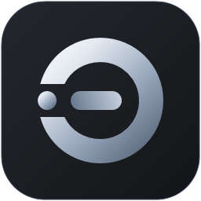

<p align="center">
  
</p>

<h1 align="center">Echo-Browser</h1>

<p align="center">
  Ein schlanker Windows-Browser auf Basis von Chromium (WebView2) und WPF – mit eingebautem Werbeblocker,
  Chrome-Erweiterungen und einem ruhigen Silber-/Anthrazit-Design.
</p>

---

## Funktionen

- **Tabs** mit Website-Symbolen, Drag & Drop, Kontextmenü (Duplizieren, Stummschalten, Andere schließen …),
  Ton-Anzeige, Mittelklick zum Schließen und „Geschlossenen Tab wieder öffnen“
- **Angeheftete Tabs** und **Tab-Gruppen** mit Name und Farbe (Klick auf den Gruppenkopf klappt ein/aus,
  Rechtsklick bearbeitet); beides bleibt über einen Neustart erhalten
- **Vertikale Tabs**: Tabs als Liste links (wie Edge), auf Wunsch schmal nur mit Symbolen – Knopf neben dem Logo
- **Geteilte Ansicht** (Split View): zwei Tabs nebeneinander mit verschiebbarem Trenner; Adressleiste, Zoom und Suche
  gelten für die Seite mit dem Fokus. Über den Knopf in der Symbolleiste, das Tab- und Link-Kontextmenü oder `Strg+K`
- **Omnibox** mit Vorschlägen aus offenen Tabs, Lesezeichen, Verlauf und der Suchmaschine,
  Inline-Vervollständigung und Hinweis „Nicht sicher“ bei unverschlüsselten Seiten
- **Befehlspalette** (`Strg+K`): eine Suche für alle Befehle, offene Tabs, Lesezeichen, Verlauf und
  Einstellungsbereiche – mit unscharfer Suche und den Tastenkürzeln daneben
- **Auf Seite suchen**, **Zoom pro Website**, **Vollbild** (F11 und Videos), Drucken und „Seite speichern unter“
- **Sitzung** wird laufend gesichert; nach einem Absturz bietet Echo an, alle Fenster und Tabs wiederherzustellen.
  Beim Wiederherstellen lädt nur der aktive Tab sofort, die übrigen beim ersten Anklicken
- **Tab-Schlaf**: inaktive Tabs werden nach einstellbarer Zeit eingefroren (Tabs mit Ton bleiben wach) und nach langer
  Zeit ganz entladen; **Leistung & Speicher** im Menü zeigt den Arbeitsspeicher gesamt und pro Tab
- **Inkognito-Fenster** mit eigenem InPrivate-Profil (Cookies und Verlauf bleiben getrennt)
- **Website-Berechtigungen** (Kamera, Mikrofon, Standort, Benachrichtigungen …) mit eigener Abfrage
- **Downloads** mit Pause/Fortsetzen, Fortschrittsring und gespeicherter Liste
- **Pop-up-Blocker**, „Do Not Track“ und Global Privacy Control
- **Lesezeichen-Import** aus Chrome, Edge, Brave oder HTML-Datei sowie HTML-Export
- **Als Standardbrowser** festlegbar
- **Echo Shield** – integrierter Werbe- & Tracker-Blocker
  - Netzwerkfilter (StevenBlack-Hosts-Liste, ca. 75.000 Domains, lokal zwischengespeichert)
  - Kosmetisches Ausblenden von Werbeflächen
  - pro Website abschaltbar, mit Zähler in der Adressleiste
- **Chrome-Erweiterungen** direkt aus dem Chrome Web Store installieren, anheften und über ihr Popup bedienen
- **Lesezeichenleiste** mit Gruppen/Ordnern und Drag & Drop, **Favoriten-Seitenleiste**
- **Eigene Startseite** mit Schnellzugriff-Kacheln, „Meistbesucht“, optionalem Hintergrundbild und wählbarer Suchmaschine
  (DuckDuckGo, Google, Bing, Ecosia, Brave Search, Startpage)
- **Einstellungsseite** (`echo://settings`) für Startverhalten, Suche, Design, Datenschutz, Downloads und Tabs
- **Themes**: Silber & Anthrazit, Midnight OLED, Titanium Light, Cobalt Slate und „System“ (folgt Windows hell/dunkel) –
  plus frei wählbare Akzentfarbe; Start- und Einstellungsseite passen sich an, unter Windows 11 mit Mica-Effekt
- **Anpassbare Symbolleiste** – Schaltflächen per Rechtsklick ein- und ausblenden
- **Mehrsprachig**: Deutsch, Englisch, Französisch und Spanisch; Sprachwechsel ohne Neustart

## Voraussetzungen

| | |
|---|---|
| Betriebssystem | Windows 10 oder 11 (x64 / ARM64) |
| .NET | [.NET 8 SDK](https://dotnet.microsoft.com/download/dotnet/8.0) (zum Bauen) bzw. .NET 8 Desktop Runtime (zum Ausführen) |
| WebView2 | [Microsoft Edge WebView2 Runtime](https://developer.microsoft.com/microsoft-edge/webview2/) – unter Windows 11 bereits vorinstalliert |

## Bauen & Starten

```bash
git clone https://github.com/GoToPlayHD/Echo-Browser.git
cd Echo-Browser
dotnet run
```

Nur bauen (die EXE liegt danach unter `bin/Debug/net8.0-windows/EchoBrowser.exe`):

```bash
dotnet build
```

Release-Version als eigenständige EXE veröffentlichen:

```bash
dotnet publish -c Release -r win-x64 --self-contained false
```

Alternativ kann `EchoBrowser.csproj` direkt in Visual Studio 2022 oder JetBrains Rider geöffnet werden.

## Tests

Automatische Tests (xUnit) liegen in `tests/EchoBrowser.Tests` und prüfen u. a. den Schutz der Host-Bridge,
das Einlesen der Blockliste, die Sprachdateien (alle Sprachen vollständig, Platzhalter korrekt) und die Hilfsfunktionen.

```bash
dotnet test tests/EchoBrowser.Tests
```

Einen Entwicklungsstand neben dem installierten Echo ausprobieren, ohne dessen Daten anzufassen:
Die Umgebungsvariable `ECHO_USER_DATA_DIR` legt einen eigenen Datenordner fest (wie `--user-data-dir` bei Chrome).

```powershell
$env:ECHO_USER_DATA_DIR = "$env:TEMP\echo-dev"; dotnet run
```

## Tastenkürzel

| Kürzel | Aktion |
|---|---|
| `Strg+K` | Befehlspalette (Befehle, Tabs, Lesezeichen, Verlauf) |
| `Strg+T` / `Strg+W` | Neuer Tab / Tab schließen |
| `Strg+Umschalt+T` | Geschlossenen Tab wieder öffnen |
| `Strg+Tab` / `Strg+Umschalt+Tab` | Nächster / vorheriger Tab |
| `Strg+1` … `Strg+8` / `Strg+9` | Zu Tab 1–8 / zum letzten Tab |
| `Strg+N` / `Strg+Umschalt+N` | Neues Fenster / Neues Inkognito-Fenster |
| `Strg+L` / `Alt+D` / `F6` | Adressleiste fokussieren |
| `Alt+Enter` / `Strg+Enter` (Adressleiste) | In neuem Tab öffnen / `www.` und `.com` ergänzen |
| `Umschalt+Entf` (Vorschlag) | Eintrag aus dem Verlauf löschen |
| `Strg+R` / `F5` / `Strg+F5` | Neu laden / ohne Cache neu laden |
| `Alt+Links` / `Alt+Rechts` / `Alt+Pos1` | Zurück / Vor / Startseite |
| `Strg+F` / `F3` / `Umschalt+F3` | Auf Seite suchen / nächster / vorheriger Treffer |
| `Strg+Plus` / `Strg+Minus` / `Strg+0` | Vergrößern / Verkleinern / Zoom zurücksetzen |
| `F11` | Vollbild |
| `Strg+P` / `Strg+S` / `Strg+U` | Drucken / Seite speichern / Quelltext anzeigen |
| `Strg+D` | Seite als Lesezeichen speichern |
| `Strg+Umschalt+B` | Lesezeichenleiste ein-/ausblenden |
| `Strg+J` / `Strg+H` | Downloads / Verlauf |
| `Strg+,` / `Strg+Umschalt+Entf` | Einstellungen |
| `F12` / `Strg+Umschalt+I` | Entwicklertools |

## Projektstruktur

```
├── MainWindow.xaml            Hauptfenster (Layout)
├── MainWindow.xaml.cs         Start, Fenster, Menü
├── MainWindow.*.cs            Teildateien nach Thema: Tabs, Navigation, Bookmarks, Sidebar,
│                              Shield, Extensions, Downloads, History, Session, Keyboard,
│                              Toolbar, WebMessages
├── Models/                    Datenklassen (Tab, Lesezeichen, Verlauf, Einstellungen …)
├── Services/                  Logik ohne UI
│   ├── AdBlockerService       Echo Shield (Filterliste, Blockprüfung, kosmetische Filter)
│   ├── ExtensionService       Installation & Verwaltung von Chrome-Erweiterungen
│   ├── StartPageService       HTML der Startseite
│   ├── SettingsPageService    HTML der Einstellungsseite
│   ├── WebMessageRouter       Nachrichten der internen Seiten an das Hauptfenster
│   ├── InternalPageSecurity   Schutz der Host-Bridge vor fremden Webseiten
│   ├── LocalizationService    Übersetzungen (siehe unten)
│   └── …                      Einstellungen, Verlauf, Lesezeichen, Themes, AtomicFile
├── Views/                     Weitere Fenster (Dialoge, Sprachauswahl, Erweiterungs-Popup)
├── Themes/                    Farben & Styles
├── Localization/              Sprachdateien (de.json, en.json, …)
└── tests/EchoBrowser.Tests/    Automatische Tests
```

Benutzerdaten (Einstellungen, Lesezeichen, Verlauf, Erweiterungen, Browserprofil) liegen unter
`%LOCALAPPDATA%\EchoBrowser`.
Dort liegt auch das Protokoll (`logs\echo-<datum>.log`, die letzten 7 Tage) – bei Problemen bitte mitschicken.

Echo läuft pro Benutzer nur einmal: `EchoBrowser.exe https://example.com` öffnet die Adresse als Tab im laufenden Fenster.

## Übersetzungen

Alle Texte stehen in `Localization/<sprache>.json` und werden in die EXE eingebettet.
Fehlt ein Text in einer Sprache, wird Englisch und danach Deutsch verwendet.

| Wo | Verwendung |
|---|---|
| XAML | `Text="{loc:Loc Nav_Back}"` |
| C# | `Tr.Get("Nav_Back")` bzw. `Tr.Format("Ext_AddedMessage", name)` |
| Start-/Einstellungsseite (HTML) | `{{t:Key}}` im HTML, `{{js:Key}}` in JavaScript |

**Neue Sprache hinzufügen:** `Localization/en.json` kopieren, z. B. als `it.json`, übersetzen und die Sprache
in der Sprachauswahl (`Views/LanguageSetupWindow`) sowie auf der Einstellungsseite ergänzen.

## Mitwirken

Offene Punkte und erledigte Änderungen stehen in [TODO.md](TODO.md).
Änderungen bitte über einen eigenen Branch und Pull Request einreichen.
